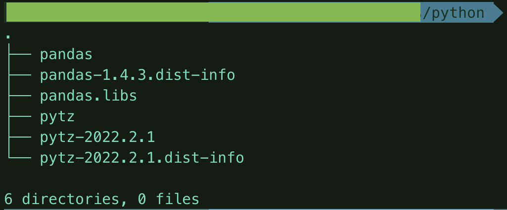

# Pandas Layer for AWS Lambda

### Compatibility
This layer is compatible for a AWS Lambda for a **x86_64** architecture.

### Installing
1. Download the zip file depending on the corresponding Python version.
2. Create a layer with the same Python version and choose the preferred architecture.
3. Inside the AWS Lambda function add the **AWSDataWrangler-Python39** layer from AWS in order to work.

OR

1. Execute `pip3 install wheel` for unpacking the next Python wheels.
2. Download the pandas wheel for the desired Python version, selecting the x86_64 architecture for many Linux. Link: https://pypi.org/project/pandas/#files
3. Download the pytz wheel. Link: https://pypi.org/project/pytz/#files
4. These files must be in the same empty directory with name `python`.
5. Unpack pandas wheel with: ```python3 -m wheel unpack <PANDAS_WHEEL_FILE_NAME>.whl``` 
6. Unpack pytz wheel with: ```python3 -m wheel unpack <PYTZ_WHEEL_FILE_NAME>.whl``` 
7. Move the inner directories from the unpacked wheels to the root directory `python`. As the following diagram: 
8. Zip all the folder.
9. Create a layer with the same Python version and choose the **x86_64** architecture. Uploading the zip.
10. Inside the AWS Lambda function add the **AWSDataWrangler-Python39** layer from AWS in order to work.